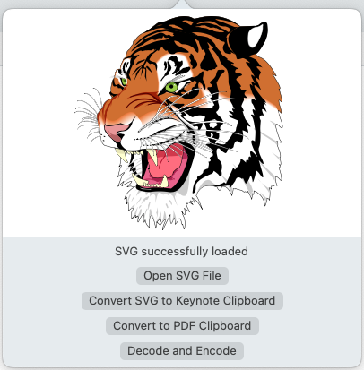

# Repository for SVG2Keynote GUI

[Jonathan Lamperth](https://www.linkedin.com/in/jonathan-lamperth-7059b418a) and [Christian Holz](https://www.christianholz.net)<br/>
[Sensing, Interaction & Perception Lab](https://siplab.org) <br/>
Department of Computer Science, ETH Zürich

Refreshed & application rewrite in Obj-C 2026; Switt Kongdachalert

This is the repository for SVG2Keynote GUI, a macOS menu bar utility for previewing Scalable Vector Graphics and pasting them into Apple Keynote as editable native Keynote shapes.
This fork is a self-contained AppKit/WebKit + Objective-C/C++ app. It builds the Keynote clipboard codec directly from source in-tree, without the old prebuilt Intel-only static archives.

NOTE : The original GUI used Swift and a Swift package for SVG preview. This fork rewrites that app layer in Objective-C / Objective-C++ / C++ and no longer depends on Swift for the app itself.

[SVG2Keynote project page](https://siplab.org/releases/SVG2Keynote)

[](https://opensource.org/licenses/MIT)


# Demo

https://user-images.githubusercontent.com/56671993/132128636-555d457e-9113-4fcb-b430-506e5e4449ff.mov


# Installation Process

## Prerequisites

- Xcode

## Option 1 - Compile with Xcode (Best Choice)

First clone the repository:

```bash
git clone https://github.com/swittk/SVG2Keynote-gui
```

Then just open the `.xcodeproj` file with Xcode and build. This produces a self-contained `SVGMenuBar.app` that does not depend on external Homebrew libraries, Inkscape, or the old vendored static archives.
The target deployment version is currently macOS 10.13. (and verified to work from Mojave to Monterey)

## Option 2 - Run the built app bundle

After building, launch the generated app from Xcode's Products folder or from `DerivedData`.

# Using the tool

Once the app has launched you should see the following icon in your toolbar:


Once clicking on the icon you will be greeted with the following popover:




Here the UI should be pretty straightforward.

1. Use `Open SVG` to pick an SVG file from disk, or `Paste SVG` to load raw SVG markup from the clipboard.
2. You can also drag an `.svg` file directly onto the menu bar item or onto the open popover.
3. If needed, copy a primitive Keynote shape and press `Resync` to learn the clipboard profile of that local Keynote installation.
4. Press `Copy Shapes` to place editable native Keynote data on the clipboard.
5. Paste into Keynote with `CMD + V`.
6. Use `Save...` to export Keynote vector clipboard data back to SVG, or clipboard images back to PNG.


# What works and what doesn't?

### Working

- Building directly from source on modern Xcode without Homebrew libraries.
- Previewing local SVG files with native system frameworks.
- Loading SVG from the clipboard.
- Dragging SVG files onto the menu bar item or the open popover.
- Copying editable native Keynote shapes to the clipboard.
- Learning and reusing compatibility profiles from real Keynote clipboard samples on the same machine/version.
- Exporting Keynote vector clipboard content back to SVG.

### Not yet working

- Cross-version or cross-machine pasting may silently fall back to PNG/TIFF image payloads instead of preserving editable native shapes.
- Some private iWork clipboard details may still vary across Keynote releases and may need a fresh compatibility resync.
- SVG features that depend on browser/file access quirks may still need manual cleanup.

# How was this tool created?

The current app is a small Objective-C AppKit/WebKit utility. It renders the SVG in a native `WKWebView`, converts the geometry into private iWork/Keynote protobuf archives, and writes native Keynote clipboard data using the same pasteboard families that Keynote itself emits.

The compatibility layer does not re-learn the entire native Keynote object graph. `Resync Compatibility` only captures and reuses the clipboard metadata/profile that a real local Keynote copy emits. This is enough to restore native pasting on many local Keynote versions, but it does not make the private iWork format a public or future-proof API.

## Repository Notes

- The repository is source-only in the current tree, but it is still relatively large because it vendors generated Keynote protobuf sources and headers directly into `KeynoteSVGUI/Vendor/keynote-protos/gen`.
- The files in `KeynoteSVGUI/Vendor/keynote-protos/gen` and `KeynoteSVGUI/Vendor/keynote-protos/mapping` were copied from the upstream `SVG2Keynote-lib` project and are intentionally committed here.
- This repo does not include the full extraction/regeneration pipeline for those files as part of the normal build.
- If Apple changes the private iWork protobuf definitions and these files ever need to be regenerated, use the maintenance scripts documented in upstream `SVG2Keynote-lib` under `keynote-protos/get-protos.sh` and `keynote-protos/dump-mappings.sh`.
    - According to the upstream maintenance docs, regeneration requires `protoc`, debugger-based type mapping extraction, and may require temporarily disabling SIP. That is why this repo keeps the generated outputs checked in instead of trying to rebuild them during a normal Xcode build.
    - Older repository history contained a prebuilt `libkeynote_lib.a` and a prebuilt app binary. Those are no longer in the working tree, but they can still make a first push of the full history slower.

## Possible future developments

- [ ]  General code optimizations
- [ ]  Use a more advanced SVG parsing library.
